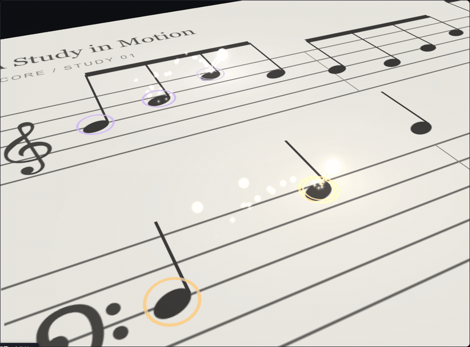
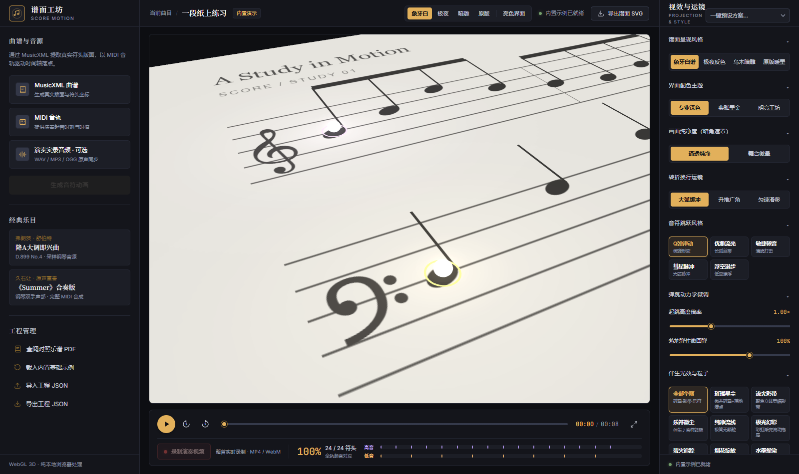
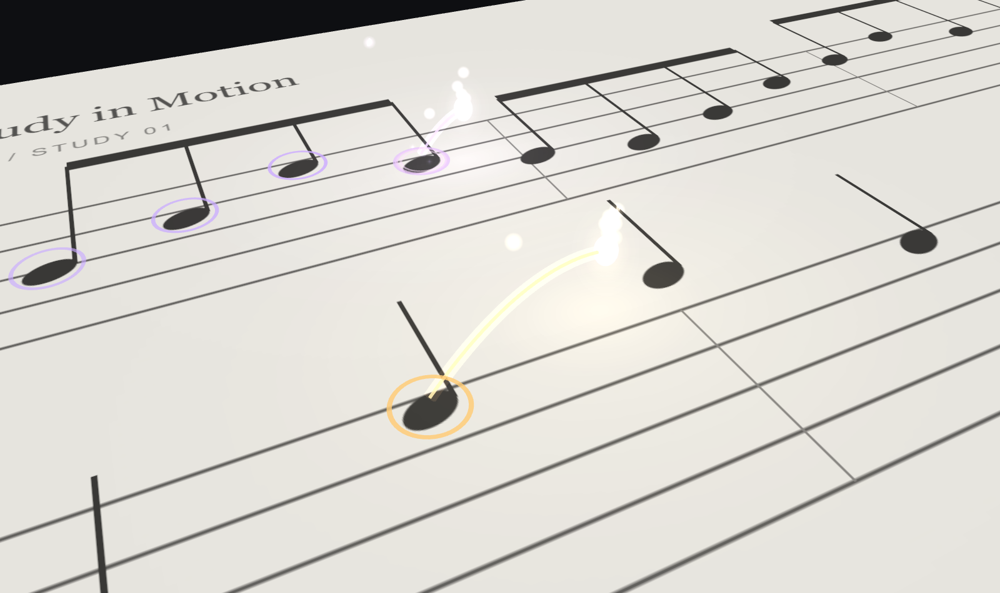

# 谱面 · 音符动画工作台 (Score Motion Workbench)

可复用的本地网页工作台：将 MusicXML/MXL 乐谱与 MIDI 音轨高精度映射到真实谱面符头，生成极富表现力的双声部 3D 跳动音符动画。支持多种粒子光效系统、运镜缓动算法、行进折返排版与音视频实时同步录制。

<p align="center">
  
</p>

---

## ✨ 核心特性

- **高精度符头映射**：自适应解析 MusicXML 与多轨 MIDI，精准匹配双手声部起音点与时值。
- **11 种音符伴生光效与粒子系统**：
  - `极光幻彩`：北极光般的彩虹流动色彩拖尾与粒子流。
  - `萤火追踪`：夏夜萤火虫般缓缓升腾、微光脉冲的暖金光点。
  - `烟花绽放`：触键瞬间多层级联的向空爆裂花火。
  - `水墨晕染`：中国传统画卷意境的墨韵涟漪扩散。
  - `电光脉冲`：高频跳跃电弧与强力电磁冲击波。
  - `气泡升腾`：梦幻虹彩浮空泡泡，带有浮力物理模拟。
  - `璀璨星尘` / `流光彩带` / `乐符微尘` / `全部华丽` / `纯净流线`。
- **光效层次动态响应**：
  - **MIDI 力度响应**：强音密集绽放，弱音轻盈点缀。
  - **音高色温映射**：低音温润暖红，高音冷冽深蓝。
  - **尾迹立体分叉** 与 **落地同心水纹涟漪**。
  - **待机微光轨道环**：静候起跳时微光环绕，起音前自动隐去不占位。
- **真实弹跳动力学仿真**：
  - 支持 `Q弹律动`、`优雅流光`、`敏捷顿音`、`彗星脉冲`、`浮空漫步` 5 种跳跃曲线。
  - 体积守恒拉伸挤压（Squash & Stretch）与落地二次微弹性回弹。
  - 乐曲起跑或声部登场前完全隐藏，临近起音（0.25s）平滑落入谱面；演奏与休止期间优雅驻留，不超时消失。
- **转折换行运镜缓冲**：
  - 支持 `大弧缓冲`、`升维广角`、`匀速滑移`，彻底消除曲谱换行时的猛甩急停。
- **全屏沉浸展示与快捷键控制**：
  - 纯净全屏无遮挡录屏模式。
  - **空格键（Space）**：全局与全屏无缝播放 / 暂停。
  - **Esc 键**：一键退出全屏放大模式。
- **预设系统与丰富主题**：
  - 一键载入 `电影级`、`演奏会`、`教学纯净`、`梦幻童话`、`赛博朋克`、`水墨古韵`、`夏夜萤火`、`烟花盛典` 预设。
  - 谱面风格提供 `象牙白谱`、`极夜反色`、`乌木暗雕`、`原版暖墨`。

<p align="center">
  
</p>

---

## 🚀 快速启动

需要 Node.js 20.19+。

```powershell
npm install
npm run dev
```

打开浏览器访问本地开发服务（默认 `http://127.0.0.1:5173/`）。

### 编译与测试

```powershell
npm run build        # 生产构建（产物输出至 dist/）
npm test -- --run    # 执行单元测试套件
```

---

## 📖 操作指南

1. **上传素材**：在左侧面板上传对应的 `.mxl` / `.musicxml` / `.xml` 乐谱，以及 `.mid` / `.midi` 音轨文件。
2. **生成动画**：点击「生成曲谱动画」，确认控制台符头匹配率（双手声部对应关系）。
3. **音频同步（可选）**：上传实录演奏音频（WAV / MP3 / OGG）用于监听与原声录制。
4. **视效调节**：在右侧检查器探索光效模式、跳跃动力学、运镜视距、色彩声部及一键预设。
5. **全屏预览与录制**：
   - 点击播放栏右侧放大图标进入全屏模式，使用 **空格键** 随时控制播放与暂停。
   - 点击「录制整首」以 30 fps 实时渲染采集画布与音轨，自动导出 MP4 / WebM 高清视频。
6. **保存与复用**：支持导出项目 JSON，随时恢复工程排版与视效配置。

<p align="center">
  
</p>

---

## 🎼 示例项目说明

- **久石让《Summer》合奏版**：
  开发模式下支持本地预览。动画展示钢琴双手声部在谱面上的对应起落，27 轨完整乐器由本地 GeneralUser GS 合成回放。音频仅供开发测试与功能验证，源文件及许可信息见 `examples/summer-local/`。
- **舒伯特《降A大调即兴曲 D.899 No.4》钢琴片段**：
  一键载入的真机范例，包含对应 MusicXML、标准 MIDI 与采样音频，素材来源位于 `public/examples/real-project/`。

---

## 范围与限制

- 乐谱解析与事件映射全部在浏览器端本地安全运行，无需上传至外部服务器。
- 钢琴双手声部依据音高层级与拍位进行智能启发式匹配；对极复杂的复杂复调、移调或多重装饰音段落，可能存在轻微对齐偏差。
- 视频录制采用 WebCodecs / MediaRecorder 实时逐帧捕获，输出质量与编码耗时取决于用户浏览器的图形硬件与 CPU 算力。

---

## 💖 特别鸣谢 / 致谢 (Special Thanks)

感谢在 AI 落地实践与认知逻辑探索中给予深刻启发与支持的创作者：

- **言说新事（学习听子）**
  - **抖音号**：`37839680559`
  - **领域标签**：`/AI探索` · `/为分享发` · `言说新事`
  - **创作者寄语**：
    > *“互联网大厂 10 多年的运营老人，也同为 AI 时代的新人～  
    > 不喜欢酷炫但浮躁的内容，想把重要的底层逻辑用不枯燥的方式分享给你～”*
  - **致谢寄语**：
    感谢其在 AI 实践、Claude Code / Codex 记忆流机制与认知架构上的真诚拆解与深度内容分享，为本项目的工具链探索与逻辑打磨提供了极具价值的思考启发！
